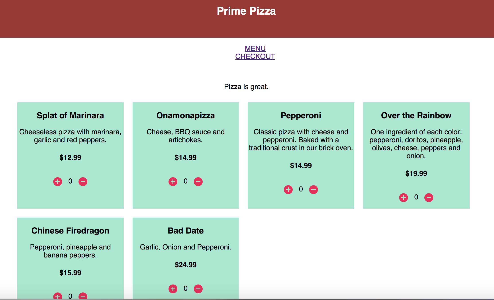
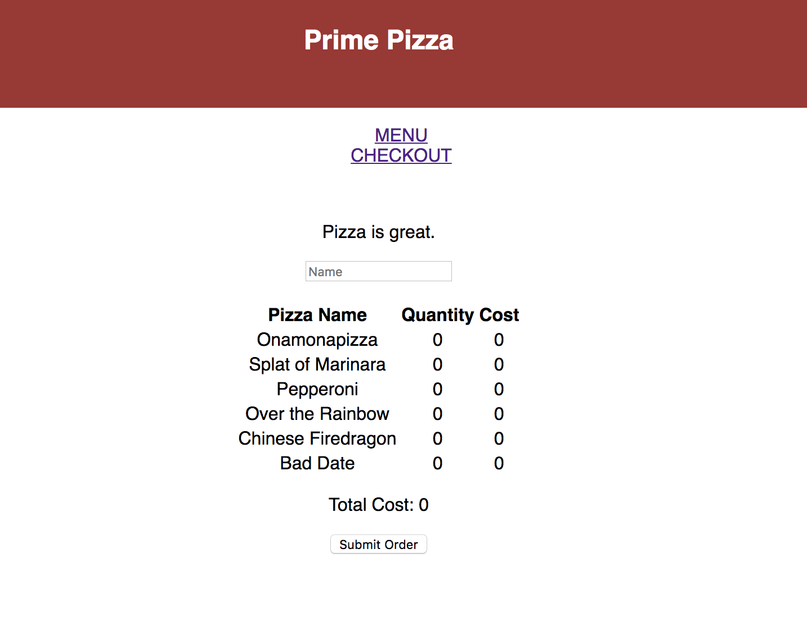

#$ React Pizza Parlor Group Project

This application was a daily group project created with React, Redux, sagas, SQL, Express, and Node.js.

## Prerequisites

Link to software that is required to install the app (e.g. node).

- [Node.js](https://nodejs.org/en/)
- [postgresql](https://www.postgresql.org/download/)
## Setup Instructions

* Run `npm install`
* Run `npm run server`
* Open a new terminal tab and run `npm run client`
* You should be automatically directed to `localhost:3000`. If not, navigate to `localhost:3000`.

### Create the Database and Tables with PostgreSQL

Create a new database called `pizza_parlor` and two tables: `pizza` and `order`. 

```SQL
CREATE DATABASE "pizza_parlor";

CREATE TABLE "pizza" (
  "id" serial primary key,
  "name" varchar(120),
  "description" varchar(480),
  "cost" numeric
);

CREATE TABLE "order" (
  "id" serial primary key,
  "customer_name" varchar(120),
  "order_total" numeric
);

INSERT INTO "pizza" ("name", "description", "cost")
VALUES ('Splat of Marinara', 'Cheeseless pizza with marinara, garlic and red peppers.', 12.99),
('Onamonapizza', 'Cheese, BBQ sauce and artichokes.', 14.99),
('Pepperoni', 'Classic pizza with cheese and pepperoni. Baked with a traditional crust in our brick oven.', 14.99),
('Over the Rainbow', 'One ingredient of each color: pepperoni, doritos, pineapple, olives, cheese, peppers and onion.', 19.99),
('Chinese Firedragon', 'Pepperoni, pineapple and banana peppers.', 15.99),
('Bad Date', 'Garlic, Onion and Pepperoni.', 24.99);

```

### MENU

On this page, a user will see all pizza options. They can add pizzas to the order by clicking the "+" button. If they would like to deselect a pizza, they can click the "-" button. The number of each type of pizza in the order will display between the two buttons.



### CHECKOUT

On this page, a user will enter their name. They will be able to see all pizzas included in the order and see the total cost. If the order looks correct, the user will submit the order. If any changes are necessary, the user will navigate back to the menu page to edit the order.




### Next Steps

Features that you would like to add at some point in the future.

- [ ] Be able to create users and place orders by user.
- [ ] Save past orders per user.
- [ ] Create a new route that allows admins to add pizzas [http://localhost:3000/admin].
- [ ] Create a junction table and keep track of which pizzas are added to each order.
- [ ] Add a button on the orders page to track delivery status.
- [ ] Give each pizza an image url and add pictures to the `public/images` folder.

## Authors

* Sarah Bloom
* Ian Carthey
* Teagan Nouska

## Acknowledgments

* Thanks to PrimeAcademy for the base project